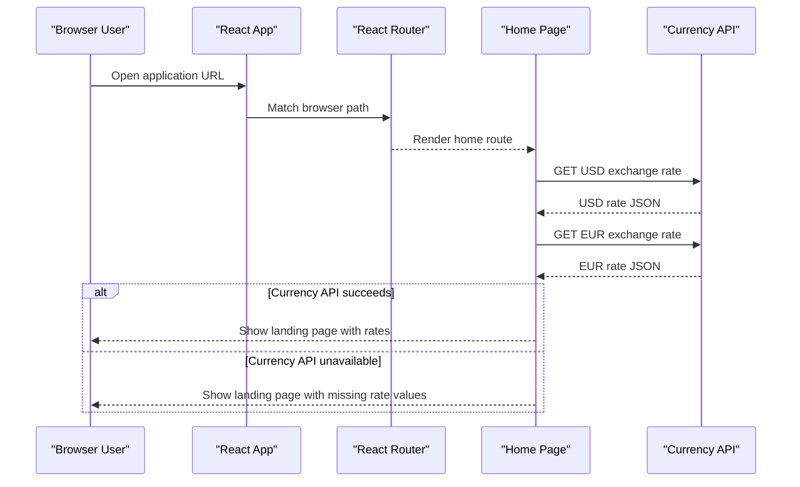

# API & Service Communication Contracts

LinuxBanking exposes a client-side route surface for a browser SPA and does not define server-hosted HTTP API endpoints. Communication is synchronous browser navigation plus direct browser fetch calls to a public currency API.

## Service Catalog

| Service | Port | Category | Purpose |
|---|---:|---|---|
| linuxbanking frontend | Vite default 5173 during development | API Layer | Static React single page application for banking demo screens |
| AwesomeAPI Currency API | External HTTPS | Infrastructure | Public third-party API used by the home page to retrieve USD and EUR exchange rates |

## API Endpoints Inventory

| Service | Method | Path | Request Type | Response Type |
|---|---|---|---|---|
| linuxbanking frontend | Client route | `/`, `/home` | Browser path | Home page component |
| linuxbanking frontend | Client route | `/signup`, `/cadastro`, `/cadastrar` | Browser path and form state | Signup page component |
| linuxbanking frontend | Client route | `/signin`, `/login`, `/logar` | Browser path and form state | Signin page component |
| linuxbanking frontend | Client route | `/dashboard` | Browser path | Dashboard page component |
| linuxbanking frontend | Client route | `/extract`, `/extrato` | Browser path | Extract page component |
| linuxbanking frontend | Client route | `/withdraw` | Browser path and form state | Withdraw page component |
| linuxbanking frontend | Client route | `/finances` | Browser path and form state | Finances page component |
| linuxbanking frontend | Client route | `/successtransaction` | Browser path | SuccessTransaction page component |
| linuxbanking frontend | Client route | `*` | Unmatched browser path | NotFound page component |
| AwesomeAPI Currency API | GET | `https://economia.awesomeapi.com.br/json/last/usd` | None | JSON with `USDBRL.ask` consumed by Home |
| AwesomeAPI Currency API | GET | `https://economia.awesomeapi.com.br/json/last/eur` | None | JSON with `EURBRL.ask` consumed by Home |

## Management & Observability Endpoints

| Service | Endpoint | Custom Metrics |
|---|---|---|
| linuxbanking frontend | None detected | None detected |

## DTOs & Contracts

No formal API DTOs, OpenAPI documents, GraphQL schemas, or protobuf contracts are present. The only typed contract found is the `Props` interface for the `ExtractItem` component, which describes statement-row display properties passed from `Extract` to the child component. External currency API responses are consumed dynamically without a TypeScript response interface or runtime validation. Serialization is the browser Fetch API response JSON parsing.

## Communication Patterns

The application uses synchronous in-browser routing via React Router and direct page redirects through anchors and `window.location.href`. The only external service calls are unauthenticated HTTPS fetch requests from the Home page to AwesomeAPI for exchange rates. No async messaging, service discovery, API gateway, circuit breaker, retry policy, timeout policy, or client-side load balancing is configured. No API-level authentication, authorization, or TLS termination is implemented in this repository; routes are publicly accessible static frontend routes, while outbound third-party calls use HTTPS URLs.

## Service Technology Matrix

| Service | Web | Data Access | Discovery | Gateway | Actuator | Cache | Metrics |
|---|---|---|---|---|---|---|---|
| linuxbanking frontend | React SPA | None | None | None | None | None | None |
| AwesomeAPI Currency API | External REST API | Not in repository | DNS URL | Not in repository | Not in repository | Not in repository | Not in repository |

## Service Communication Sequence

