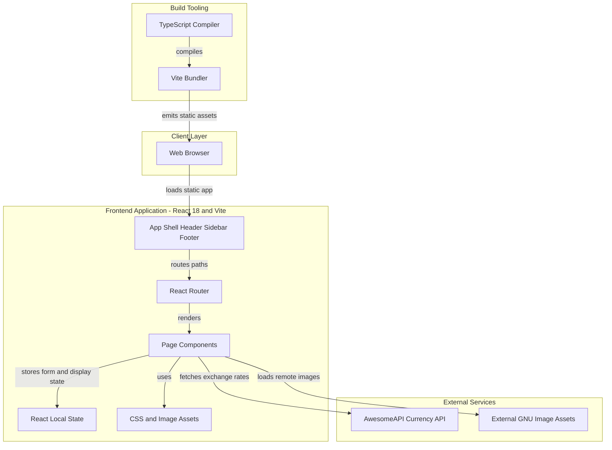
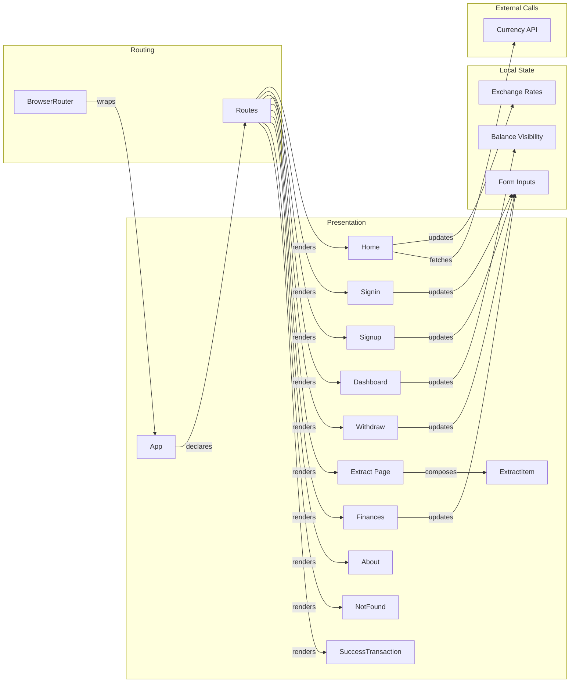

# Architecture Diagram

LinuxBanking is a single page React application built with TypeScript and Vite. The application is entirely client-side, with page components handling navigation, display logic, and lightweight in-browser state.

## Application Architecture

### Technology Stack Summary

| Layer | Technology | Version | Purpose |
|---|---:|---:|---|
| Presentation | React | 18.2.0 | Component based browser UI |
| Routing | React Router DOM | 6.4.0 | Client side route matching and page rendering |
| Language | TypeScript | 4.8.3 locked, 4.6.4 declared | Static typing and JSX compilation |
| Build | Vite | 3.2.7 locked, 3.1.0 declared | Development server and production bundle generation |
| Styling | CSS modules by folder convention | N/A | Page and component styling |

### Data Storage & External Services

No database, cache, message broker, or server-side data store is declared in the repository. Runtime data is kept in React component state, with the home page retrieving USD and EUR exchange rates directly from the AwesomeAPI public currency API and several pages loading remote GNU image assets by URL.

### Key Architectural Decisions

- Implements a static single page application with browser-side routing rather than a backend API layer.
- Keeps banking demo state such as balances, login inputs, signup inputs, and transaction amounts in local React component state only.
- Uses direct browser navigation through anchors and `window.location.href` for several flows instead of centralized navigation helpers.

## Component Relationships

### Component Inventory

| Component | Layer | Type | Responsibility |
|---|---|---|---|
| App | Presentation | React component and route shell | Provides shared header, sidebar, footer, and client route declarations |
| Home | Presentation | React page | Displays landing content and current currency exchange rates |
| Signup | Presentation | React page | Collects user registration fields and displays a temporary confirmation |
| Signin | Presentation | React page | Collects login inputs and navigates to the dashboard when both fields are populated |
| Dashboard | Presentation | React page | Displays the mock account balance and navigation to statements, withdrawals, deposits, and financing |
| Withdraw | Presentation | React page | Lets users choose withdrawal or deposit mode and submit a mock transaction |
| Extract Page | Presentation | React page | Displays fixed statement rows using the reusable ExtractItem component |
| ExtractItem | Presentation | React component | Renders one statement row with invoice metadata and a download link |
| Finances | Presentation | React page | Simulates financing interest at a fixed percentage |
| SuccessTransaction | Presentation | React page | Displays transaction success and redirects back to the dashboard |
| About | Presentation | React page | Presents static project and Linux related information |
| NotFound | Presentation | React page | Displays a not found page and redirects to home |
