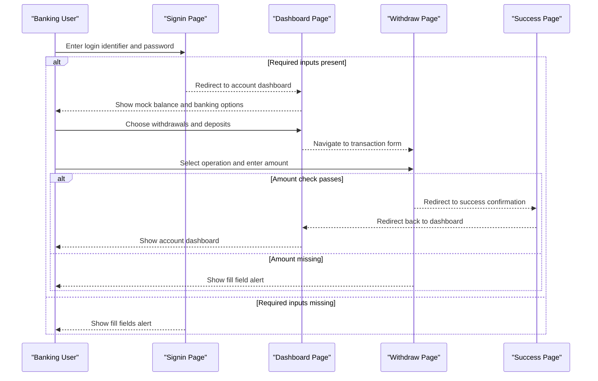

# Core Business Workflows

LinuxBanking models basic consumer banking interactions in a browser UI: account registration, sign-in, balance viewing, statement viewing, deposits or withdrawals, and financing interest simulation. These workflows are mock client-side flows rather than persisted banking transactions.

## Domain Entities

| Entity | Service / Bounded Context | Description | Key Relationships |
|---|---|---|---|
| Customer Registration | Frontend account onboarding | User-entered identity and contact information collected during signup | Produces a temporary confirmation view before redirecting to login |
| Login Attempt | Frontend session entry | Email or CPF plus password values used to gate navigation to the dashboard | Successful when both inputs are present; no backend authentication occurs |
| Account Balance | Frontend account dashboard | Mock current balance displayed to the user | Can be shown or hidden in the dashboard view |
| Transaction Operation | Frontend transaction flow | User choice between withdrawal and deposit with an entered amount | Leads to success confirmation when the local validation check passes |
| Statement Item | Frontend statement view | Static invoice or statement row displayed in the extract page | Rendered through the reusable ExtractItem component |
| Financing Simulation | Frontend financing flow | User-entered financing amount used to calculate fixed interest | Computes a local interest amount using a fixed percentage |
| Currency Quote | Frontend market summary | USD and EUR exchange rate values fetched for display | Retrieved from a third-party currency API on home page load |

## Service-to-Domain Mapping

| Service | Domain Context | Owned Entities | External Dependencies |
|---|---|---|---|
| linuxbanking frontend | Banking customer experience | Customer Registration, Login Attempt, Account Balance, Transaction Operation, Statement Item, Financing Simulation | AwesomeAPI currency quote endpoint, remote GNU image assets |

## Primary Workflows

### Workflow 1: View Dashboard and Navigate Banking Features

A user signs in with non-empty credentials and is redirected to the dashboard. The dashboard displays a mock balance, allows toggling balance visibility, and provides navigation entry points to statements, withdrawal or deposit operations, and financing simulation.

Steps:
1. User enters email or CPF and password on the sign-in page.
2. The page checks that both fields contain values.
3. If validation passes, browser navigation redirects to the dashboard.
4. User toggles account balance visibility or navigates to extract, transaction, or financing views.

Business rules involved: required sign-in input check and balance visibility toggle. No authorization, server-side session, or account ownership rule is enforced.

### Workflow 2: Register Customer Account

A prospective customer enters registration information on the signup page. If required local fields are present, the page displays the submitted data temporarily and redirects to the login page.

Steps:
1. User enters name, email, CPF, password, and address.
2. The signup handler checks selected required fields for non-empty values.
3. If the check passes, a confirmation area renders the submitted user details.
4. After a short delay, the browser redirects to the login route.

Business rules involved: local required-field check. The password field is collected but is not included in the local completion condition or persisted.

### Workflow 3: Submit Withdrawal or Deposit

A dashboard user selects withdrawal or deposit mode, enters an amount, and submits the transaction flow. A successful local check redirects to the success page, which then redirects back to the dashboard.

Steps:
1. User selects withdrawal or deposit mode.
2. User enters an amount in the active input.
3. The handler performs a local non-empty or non-zero check.
4. If the check passes, browser navigation redirects to the success page.
5. The success page redirects back to the dashboard after a short delay.

Business rules involved: local amount presence check. No account balance mutation, overdraft check, ledger write, or transaction authorization is implemented.

### Workflow 4: Simulate Financing Interest

A user enters a financing amount and triggers a simple interest calculation. The page calculates five percent of the entered value and displays the result in an alert.

Steps:
1. User enters a numeric financing amount.
2. The page converts the string input to a number.
3. The page computes a fixed five percent interest amount.
4. The result is shown with a browser alert.

## Cross-Service Data Flows

There are no backend services or persisted cross-service data flows. The only external data flow fetches currency rates directly from AwesomeAPI into the Home component, where the response values are displayed independently. If the external API is unavailable, the page still renders but the rate values remain unset because no retry, fallback value, or error message is configured.

## Business Workflow Sequence

## Business Rules & Decision Logic

- Sign-in requires both login identifier and password inputs to contain values before dashboard navigation.
- Signup requires name, email, CPF, and address inputs to contain values before showing confirmation and redirecting; no persistence or duplicate-account decision exists.
- Dashboard balance visibility toggles between the mock numeric balance and a masked display value.
- Withdrawal and deposit submission uses a local amount presence or non-zero check before redirecting to success; there is no ledger entry, balance update, or negative balance rule.
- Financing simulation applies a fixed five percent interest calculation to the entered amount and displays the computed value.
- Currency quotes are displayed from the external API when available; no business fallback is provided if the fetch fails.
- Transaction boundaries, audit trails, compensating actions, role-based authorization, and server-side error handling are not implemented in the repository.
