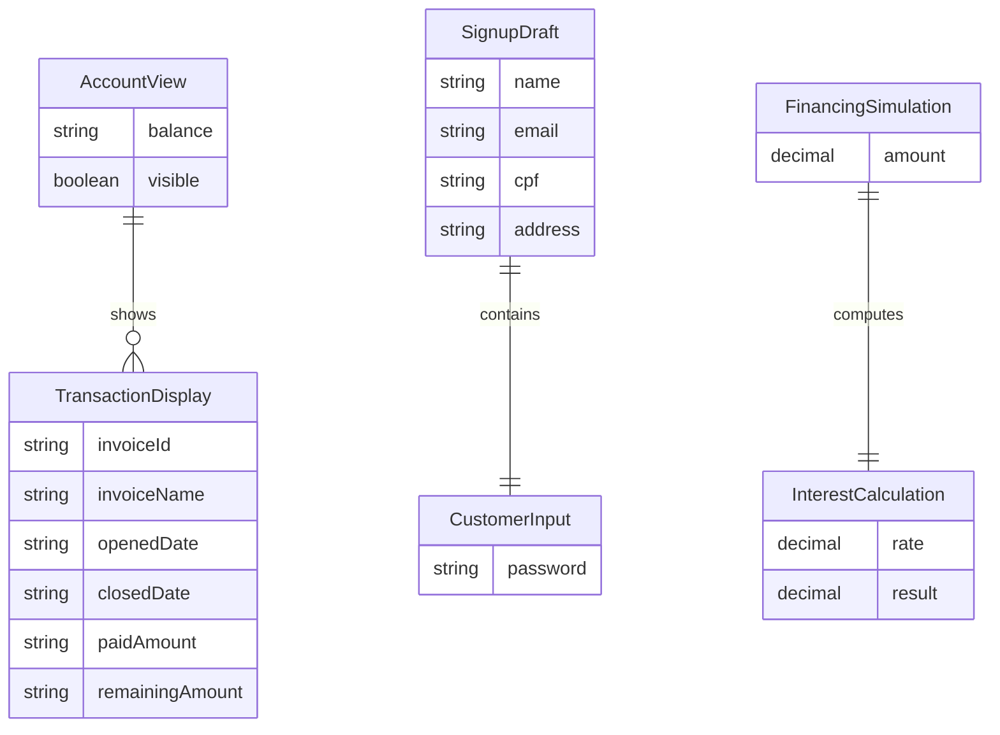

# Data Architecture & Persistence Layer

LinuxBanking has no repository-backed persistence layer, database schema, ORM entities, migrations, or client-side durable storage. Its data model consists of transient React state and fixed display data embedded in components.

## Database Configuration

| Service/Module | DB Type | Profile | Driver | Connection | Migration Tool |
|---|---|---|---|---|---|
| linuxbanking frontend | None detected | All | None | None | None |

## Data Ownership per Service

| Service | Tables Owned | ORM Framework | Caching | Notes |
|---|---|---|---|---|
| linuxbanking frontend | None | None | React component state only | No database-backed bounded context is implemented |

## Entity Model

## Key Repository Methods

| Service | Repository | Notable Methods | Purpose |
|---|---|---|---|
| linuxbanking frontend | None detected | N/A | No repository interfaces or data access methods are present |

## Caching Strategy

No cache provider, persistent browser storage, service worker cache, or query result cache is configured. Values such as login input, signup input, balance visibility, financing amount, withdrawal amount, deposit amount, and currency rates are held only in React `useState` variables for the lifetime of the rendered components.

## Data Ownership Boundaries

There is no shared or isolated application database. Data displayed by banking pages is either hard-coded in components, entered by the user into local component state, or fetched from the external currency API. Because there are no backend services, cross-service data joins, CQRS patterns, or direct database access boundaries are not present.

### Data Classification & Sensitivity

| Entity | Sensitive Fields | Classification | Controls in Place |
|---|---|---|---|
| SignupDraft | name, email, cpf, address | PII | No encryption-at-rest, masking, or field-level access controls are implemented because data is not persisted; entered values are rendered back to the page |
| CustomerInput | password | Sensitive credential input | HTML password input masks on screen, but no authentication backend, secure storage, or transport beyond browser page context is implemented |
| AccountView | balance | Financial data | Mock value in local state only; no access controls detected |
| TransactionDisplay | invoice name, amounts, dates | Financial data | Static mock data in component source; no persistence controls detected |
| FinancingSimulation | amount | Financial data | Local state only; no persistence controls detected |
