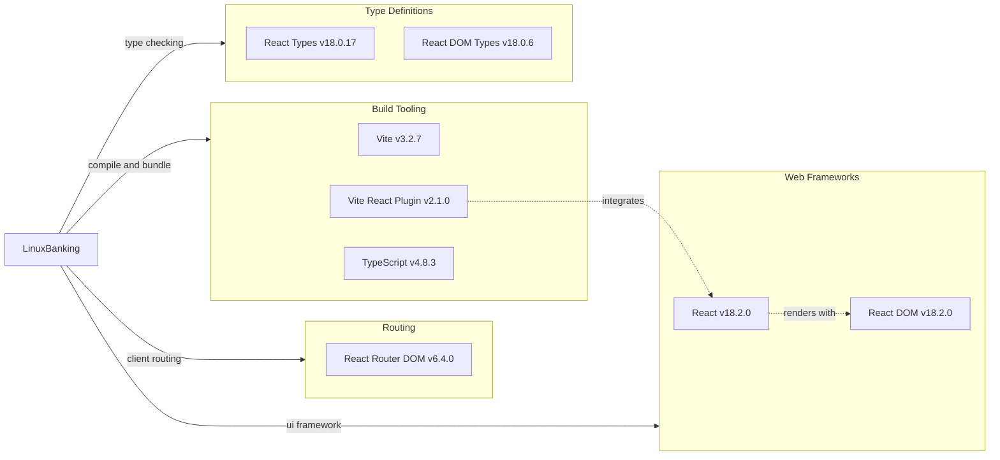

# Dependency Map

LinuxBanking declares 8 direct npm dependencies across runtime and development categories, with 3 runtime libraries and 5 development or build-time packages.

## Dependencies

### Dependency Summary

| Category | Count | Key Libraries | Notes |
|---|---:|---|---|
| Web Frameworks | 2 | React 18.2.0, React DOM 18.2.0 | Browser UI runtime stack |
| Routing | 1 | React Router DOM 6.4.0 | Declarative client side route handling |
| Build Tooling | 3 | Vite 3.2.7, Vite React Plugin 2.1.0, TypeScript 4.8.3 | Development server, JSX transform, type checking, and production bundling |
| Type Definitions | 2 | React Types 18.0.17, React DOM Types 18.0.6 | Compile time typing support |

### Version & Compatibility Risks

The npm assessment reports major updates available for React, React DOM, React Router DOM, TypeScript, Vite, and the Vite React plugin. Moving to those versions may require compatibility testing because React 19, React Router 7, Vite 8, and newer TypeScript releases include breaking API and tooling changes. `npm ci` also reported existing dependency advisories in the locked dependency tree, including high and critical severities, which should be reviewed separately before production use.

### Notable Observations

- The runtime dependency graph is small and focused on browser rendering and routing.
- There are no declared backend, database, authentication, state management, testing, or API client libraries.
- Vite and TypeScript are declared with older major versions compared with currently available releases.
- The project uses both `package-lock.json` and `yarn.lock`, which can cause dependency resolution drift if multiple package managers are used interchangeably.

## Test Dependencies

| Framework | Version | Notes |
|---|---:|---|
| None detected | N/A | No Jest, Vitest, React Testing Library, Cypress, or Playwright dependency is declared. |

Total test-scope dependencies: 0
No test dependencies detected. The project currently has no automated test script in `package.json`.
